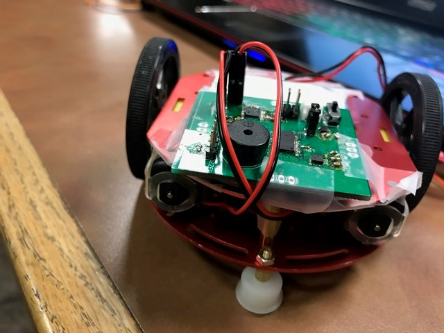
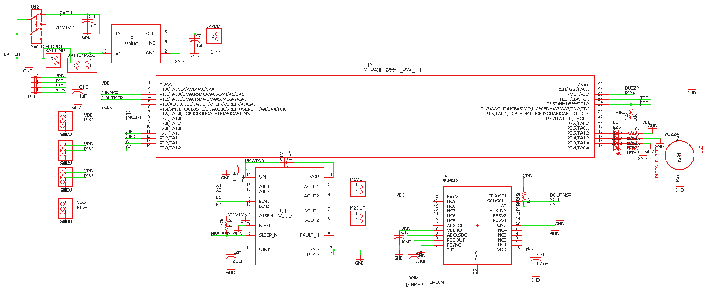

## The Cliff-Detecting Robot!
# Team Members
-Matthew Disiena 
-Alex Dzeda
-Victor Gonzalez
-Joshua Phipps

Welcome to the overview of our cliff-detecting robot! If you're interested in looking at our demo video, head [here](http://www.youtube.com/watch?v=5AqDvhuFCWw), but for a full run-down check out our presentation video [here](http://www.youtube.com/watch?v=SUiz2lATAr0).

**Concept**
The goal of this project was to design a robot that utilizes SPI to communicate with an inertial measurement unit to allow the robot to react to its environment, in this case backing up when it detects that its driving off a cliff. In order to demonstrate this functionality, the robot uses PWM signals to drive a pair of motors, allowing the robot to move around in different directions and at different speeds. We were originally going to use PIR sensors to detect objects moving toward our robot, and have our robot move in the opposite direction of these objects.  After running several tests, though, we realized that the PIR sensors we were using were not able to perform at the accuracy or precision we would have needed for this project.  Therefore, we changed our project from a “hide and seek” robot to a “cliff detecting robot”.

Figure 1. Image of Robot

**MPU9250 Inertial Measurement Unit**
The IMU measures the acceleration in all three axis. It also measures the change in orientation in all three axis.  The acceleration is on a scale of  ±2g.  The change in orientation is on a scale of ±250 degrees per second.  The acceleration and orientation data is stored in registers on the device.  This data can be sent through its SPI interface.  The device works like a master and the msp will act as the slave.  When chip select is low, data can be read and written until chip select is high.  We read from the SOMI line on the MSP430.

**H-Bridge Motor**
We chose to utilize the DRV8833 in order to control our two motors. The DRV8833 is a dual H-bridge that provides full control over each motor. This allows us to control not only the direction of each motor, but the speed as well. We planned to use the “sleep” functionality of the motor, however due to the low margin on the minimum allowable voltage of the motors, (they run at 3V, our linear regulator runs at 3.3V and can only supply a small amount of power) we decided to have it always on.

**Design**

Figure 2. Schematic of the Robot's Operating System

We utilized a 28 pin MSP430G2553 in order to maximize the number of pins we could use. The most significant advantage is that we are able to drive 4 separate channels of PWM in order to fully control 2 motors. The advantage of using PWM is that it allows us to control to speed as well as the direction of the robot. This is important because if the robot is moving too fast, it won't have enough time to react to cliffs. Additionally, if the robot tries to switch directions too quickly, it will jump, which can disrupt the IMU.

As stated, four PWM signals control the 2 motors attached to the robot's wheels; 2 signals for each wheel. The signal being asserted tells the robot which direction to move and the duty cycle of the pulse train determines the velocity. For instance, to turn right we would have the right wheel go forward and the left wheel go back. This would correspond to setting registers 1 and 2 of TA1CC and TA2CC.

When moving the robot, it was necessary to allow it to move slow enough to react to changes in the gyroscope setting. However, if the robot moves too slowly, the motor will have a difficult time overcoming its inertia. Thus, we start the robot with a duty cycle of 20% to keep it from bucking, switch it to 35% briefly to allow it to pick up momentum then slow it down to 15% while it continues to move forward. We employ a similar procedure when the robot detects a cliff. First we have it move backwards at a high speed to get it away from the cliff, then slow it down so it can turn and move forward again without bucking and disrupting the IMU.

The Inertial Measurement Unit (IMU) is what allows the robot to self-correct in case it starts to drive off a cliff. The IMU allows us to measure the acceleration or change in orientation in each direction. Normally, the acceleration in the z direction should be equal to the contribution of the force of gravity. If it deviates from this value, then we know that the robot is either being lifted up or starting to fall down. Thus, when such a change is detected we can have the robot back up, reorient and move in a different direction.

The IMU interacts with the MSP430 with an SPI interface.  The IMU acts as a slave device while the MSP430 acts as the master.  There are two control and two data lines.  The chip select line is input from the MSP430 to the IMU, and signals the start and end of transmission.  The IMU contains registers which hold the data for the measurements.  This data has to be read from the registers by using the address of the register on the MPU.  This data is read with the MPU by the serial interface that waits on the receive buffer.

For proof of concept, we programmed the robot to act through a small finite state machine. Using PWM, we set the robot to move forward at a slow speed until it encounters a cliff, which is identified as a change in rotation along the x axis, as determined by the gyroscope on the IMU. Then, the robot enters its 'cliff detected' state. We use PWM to back the robot away from the cliff, slow it down then turn in a random direction. The robot then returns to its main state, where it moves around until it encounters another cliff. This routine demonstrates the ability of the robot to use PWM and SPI to interact and respond to its environment.

### Contact
Have any questions? Feel free to reach out to our professor Caleb Kemere at Rice University!
